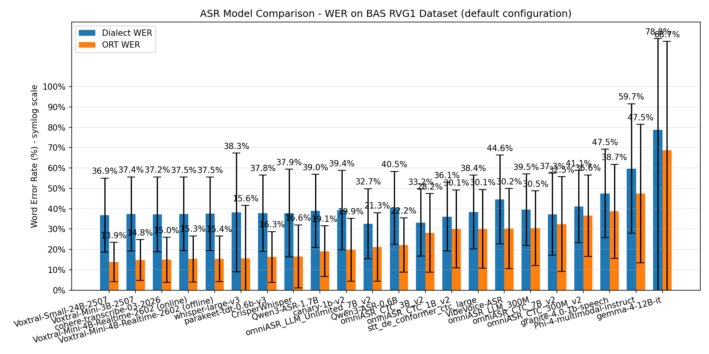
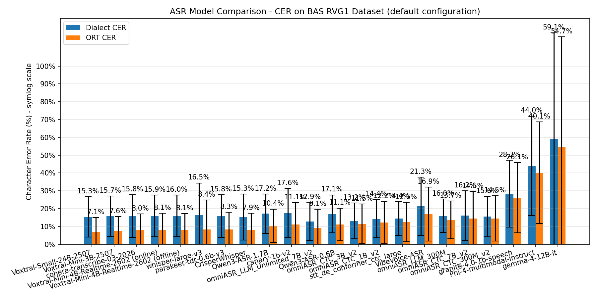

# ASR Benchmark Framework





A generic framework for benchmarking Automatic Speech Recognition (ASR) models on speech
datasets. **Models** implement one interface (`src/models/base.py::AsrModel`), **datasets**
implement another (`src/datasets/base.py::DatasetSource`), and the generic engine
(`src/benchmark/runner.py`) scores any model × any dataset. After every run a color-coded
leaderboard (HuggingFace Open ASR style) is printed.

## Architecture

| Component | Location | Role |
|---|---|---|
| Model interface | `src/models/base.py` (`AsrModel`) | `transcribe_batch(paths) -> texts`; lazy backend load |
| Model registry | `src/models/registry.py` (`get_model`) | name → model instance |
| Dataset interface | `src/datasets/base.py` (`DatasetSource` / `Sample`) | yields samples with **named references** (`ort`, `dialect`, `kan`, …) |
| Dataset registry | `src/datasets/registry.py` (`get_dataset`) | name → dataset instance |
| Engine | `src/benchmark/runner.py` (`run_benchmark`) | batched inference, per-reference WER/CER, RTFx |
| Result schema | `src/benchmark/result.py` (`BenchmarkResult`) | v2 JSON; `from_dict` migrates legacy v1 results |
| Leaderboard | `src/leaderboard/` | color-coded terminal table + HTML + Markdown |
| SLURM (kiz0) | `slurm/`, `scripts/submit_matrix.py`, `configs/matrix.yaml` | submit model × dataset matrix |

## Quickstart

```bash
# Benchmark one model on one dataset (prints the color-coded leaderboard after)
python scripts/benchmark.py --model openai/whisper-large-v3 --dataset bas_rvg1 \
    --data-dir $BAS_RVG1_DATA_DIR

# Re-render the color-coded leaderboard from all results/ JSONs (no GPU needed)
python scripts/leaderboard.py --export html,md          # writes results/leaderboard.{html,md}

# Run the whole matrix on the kiz0 SLURM cluster (one job per model × dataset,
# then an aggregation job that renders the leaderboard once all finish)
python scripts/submit_matrix.py --config configs/matrix.yaml
python scripts/submit_matrix.py --config configs/matrix.yaml --dry-run   # preview sbatch scripts
python scripts/submit_matrix.py --config configs/matrix.yaml --local     # run sequentially, no SLURM
```

SLURM parameters live in `slurm/kiz0.env` (partition `p1,p2,p6`, `--gres=gpu:1`,
`--qos=gpuultimate`, `--time=04:00:00`, venv activation). The benchmark matrix
(which models × which datasets) lives in `configs/matrix.yaml`.

### Adding a model or dataset

- **Model:** subclass `AsrModel`, implement `transcribe_batch`, drop it in `src/models/`,
  and add a routing branch to `src/models/registry.py`.
- **Dataset:** subclass `DatasetSource`, yield `Sample`s with a `references` dict, and
  register it in `src/datasets/registry.py`.

## Supported Models

- **OmniASR-LLM** (default) - Facebook's omnilingual LLM-based ASR (e.g., `omniASR_LLM_Unlimited_7B_v2`, `omniASR_LLM_300M`)
- **OmniASR-CTC** - Facebook's CTC-based multilingual ASR (e.g., `omniASR_CTC_300M_v2`, `omniASR_CTC_1B_v2`, `omniASR_CTC_3B_v2`, `omniASR_CTC_7B_v2`, 1600+ languages)
- **Whisper** - OpenAI's Whisper models via HuggingFace (e.g., `openai/whisper-large-v3`)
- **CrisperWhisper** - nyrahealth's fine-tuned Whisper with verbatim transcription (e.g., `nyrahealth/CrisperWhisper`)
- **Parakeet** - NVIDIA NeMo Parakeet models (e.g., `nvidia/parakeet-ctc-1.1b`)
- **Canary-Qwen** - NVIDIA NeMo SALM model (e.g., `nvidia/canary-qwen-2.5b`, English-only)
- **Canary-1b-v2** - NVIDIA NeMo ASR model (e.g., `nvidia/canary-1b-v2`, 25 European languages)
- **Qwen3-ASR** - Alibaba's Qwen3-ASR models (e.g., `Qwen/Qwen3-ASR-1.7B`, `Qwen/Qwen3-ASR-0.6B`, 30+ languages)
- **Voxtral** - Mistral AI's Voxtral models (e.g., `mistralai/Voxtral-Mini-3B-2507`, `mistralai/Voxtral-Small-24B-2507`)
- **Voxtral Realtime** - Mistral AI's real-time streaming ASR (e.g., `mistralai/Voxtral-Mini-4B-Realtime-2602`, 4B params, 13 languages)
- **Phi-4 Multimodal** - Microsoft's Phi-4 multimodal model (e.g., `microsoft/Phi-4-multimodal-instruct`)
- **VibeVoice** - Microsoft's VibeVoice-ASR model (9B params, up to 60 min audio)
- **Granite Speech** - IBM Granite 4.0 1B Speech model (e.g., `ibm-granite/granite-4.0-1b-speech`, 6 languages)
- **Cohere Transcribe** - Cohere's Conformer-based ASR model (e.g., `CohereLabs/cohere-transcribe-03-2026`, 2B params, 14 languages)
- **NeMo STT Conformer** - NVIDIA NeMo Conformer CTC/RNNT models (e.g., `nvidia/stt_de_conformer_ctc_large`, 120M params, German)

## Installation

```bash
# Clone the repository
git clone https://github.com/ChipCracker/omni-asr-benchmark.git
cd omni-asr-benchmark

# Create virtual environment
python -m venv .venv
source .venv/bin/activate

# Install core dependencies
pip install -r requirements.txt

# Install OmniASR (for OmniASR models)
pip install git+https://github.com/facebookresearch/omnilingual-asr.git

# Install Whisper dependencies (optional)
pip install transformers torch accelerate

# Install CrisperWhisper dependencies (optional, for CrisperWhisper)
pip install git+https://github.com/nyrahealth/transformers.git@crisper_whisper

# Install NeMo dependencies (optional, for Parakeet)
pip install nemo-toolkit[asr]

# Install NeMo trunk (optional, for Canary-Qwen - requires PyTorch 2.6+)
pip install 'nemo_toolkit[asr,tts] @ git+https://github.com/NVIDIA/NeMo.git'

# Install NeMo dependencies (optional, for Canary-1b-v2)
pip install nemo-toolkit[asr]

# Install Qwen3-ASR dependencies (optional, for Qwen3-ASR)
pip install qwen-asr

# Install Voxtral / Voxtral Realtime dependencies (optional)
pip install --upgrade "transformers>=5.2.0"

# Install Phi-4 dependencies (optional, for Phi-4 Multimodal)
pip install transformers>=4.48.2 soundfile flash-attn

# Install Cohere Transcribe dependencies (optional)
pip install --upgrade "transformers>=5.4.0" sentencepiece protobuf

# Install VibeVoice dependencies (optional, for VibeVoice-ASR)
git clone https://github.com/microsoft/VibeVoice.git
cd VibeVoice
pip install -e .[asr]
```

Note: The repository was renamed from `omni-asr-test` to `omni-asr-benchmark`.

## Configuration

Copy the environment template and configure:

```bash
cp .env.template .env
```

Set the `BAS_RVG1_DATA_DIR` environment variable to point to your BAS RVG1 dataset directory.

## Usage

### Evaluate with OmniASR-LLM (default)

```bash
# OmniASR-LLM 7B v2 (default)
python scripts/evaluate_rvg1.py

# OmniASR-LLM 300M - smallest LLM variant
python scripts/evaluate_rvg1.py --model-card omniASR_LLM_300M
```

### Evaluate with OmniASR-CTC

```bash
# OmniASR-CTC 300M v2 - smallest and fastest variant
python scripts/evaluate_rvg1.py --model-card omniASR_CTC_300M_v2

# OmniASR-CTC 1B v2
python scripts/evaluate_rvg1.py --model-card omniASR_CTC_1B_v2

# OmniASR-CTC 3B v2
python scripts/evaluate_rvg1.py --model-card omniASR_CTC_3B_v2

# OmniASR-CTC 7B v2 - largest CTC variant
python scripts/evaluate_rvg1.py --model-card omniASR_CTC_7B_v2
```

Note: CTC models have a 40s audio limit; files longer than 35s are automatically split into ~30s chunks. The v2 models (December 2025 update) offer improved accuracy over v1.

### Evaluate with Whisper

```bash
python scripts/evaluate_rvg1.py --model-card openai/whisper-large-v3
```

### Evaluate with CrisperWhisper

```bash
python scripts/evaluate_rvg1.py --model-card nyrahealth/CrisperWhisper
```

Note: CrisperWhisper is a fine-tuned Whisper Large V3 that provides verbatim transcription (including filler words like "um", "uh") and improved word-level timestamps.

### Evaluate with Parakeet

```bash
python scripts/evaluate_rvg1.py --model-card nvidia/parakeet-ctc-1.1b
```

### Evaluate with Canary-Qwen

```bash
python scripts/evaluate_rvg1.py --model-card nvidia/canary-qwen-2.5b
```

Note: Canary-Qwen is English-only (5.63% mean WER on HuggingFace OpenASR Leaderboard). German evaluation will show degraded results.

### Evaluate with Canary-1b-v2

```bash
python scripts/evaluate_rvg1.py --model-card nvidia/canary-1b-v2
```

Note: Canary-1b-v2 supports 25 European languages including German (de), English (en), French (fr), Spanish (es), Italian (it), and more.

### Evaluate with Qwen3-ASR

```bash
# Qwen3-ASR 1.7B
python scripts/evaluate_rvg1.py --model-card Qwen/Qwen3-ASR-1.7B

# Qwen3-ASR 0.6B (smaller, faster)
python scripts/evaluate_rvg1.py --model-card Qwen/Qwen3-ASR-0.6B
```

Note: Qwen3-ASR supports 30+ languages with automatic language detection. Recommended for German transcription.

### Evaluate with Voxtral

```bash
# Voxtral Mini (3B) - ~9.5 GB GPU RAM
python scripts/evaluate_rvg1.py --model-card mistralai/Voxtral-Mini-3B-2507

# Voxtral Small (24B) - larger model, better accuracy
python scripts/evaluate_rvg1.py --model-card mistralai/Voxtral-Small-24B-2507
```

Note: Voxtral supports German (de), English (en), French (fr), Spanish (es), Portuguese (pt), Italian (it), Dutch (nl), and Hindi (hi).

### Evaluate with Voxtral Realtime

**Offline mode** (full audio at once, supports batching):

```bash
python scripts/evaluate_rvg1.py --model-card mistralai/Voxtral-Mini-4B-Realtime-2602 --batch-size 4
```

**Online mode** (simulated streaming, chunked audio via generator):

```bash
python scripts/evaluate_rvg1.py --model-card mistralai/Voxtral-Mini-4B-Realtime-2602-online --batch-size 1
```

Note: Voxtral Realtime is a 4B parameter real-time ASR model supporting 13 languages. Native Transformers support starts with `transformers>=5.2.0`. The offline mode processes full audio files and supports batch sizes > 1. The online mode simulates real-time streaming by splitting audio into ~105 ms chunks (with a ~560 ms first chunk) and feeding them incrementally to the model; batch size is fixed to 1. Append `-online` to the model card name to select online mode. Expect roughly 16 GB VRAM for BF16 inference.

### Evaluate with Phi-4 Multimodal

```bash
python scripts/evaluate_rvg1.py --model-card microsoft/Phi-4-multimodal-instruct
```

Note: Phi-4 Multimodal supports German, English, Chinese, French, Italian, Japanese, Spanish, and Portuguese. Recommended max 40 seconds per audio. Uses flash_attention_2 on Ampere+ GPUs.

### Evaluate with VibeVoice

```bash
python scripts/evaluate_rvg1.py --model-card microsoft/VibeVoice-ASR --batch-size 1
```

Note: VibeVoice-ASR is a 9B parameter model requiring ~18-20 GB VRAM. It supports up to 60 minutes of continuous audio and includes speaker diarization (stripped for WER evaluation).

### Evaluate with Granite Speech

```bash
python scripts/evaluate_rvg1.py --model-card ibm-granite/granite-4.0-1b-speech --batch-size 1
```

Note: Granite 4.0 1B Speech supports English, German, French, Spanish, Portuguese, and Japanese. Uses a Conformer speech encoder with Granite-4.0-1b-base.

### Evaluate with Cohere Transcribe

```bash
python scripts/evaluate_rvg1.py --model-card CohereLabs/cohere-transcribe-03-2026 --batch-size 4
```

Note: Cohere Transcribe is a 2B parameter Conformer-based model supporting 14 languages including German (de), English (en), French (fr), and more. Requires transformers>=5.4.0. Supports native batching and automatic long-form audio handling.

### Evaluate with NeMo STT Conformer

```bash
python scripts/evaluate_rvg1.py --model-card nvidia/stt_de_conformer_ctc_large --batch-size 16
```

Note: NeMo STT Conformer CTC Large is a 120M parameter German-only model. Requires nemo_toolkit[asr].

## Output

Results are saved as JSON files in the `results/` directory with the model name as prefix:

- `results/omniASR_LLM_Unlimited_7B_v2_evaluation.json`
- `results/omniASR_LLM_300M_evaluation.json`
- `results/omniASR_CTC_300M_v2_evaluation.json`
- `results/omniASR_CTC_1B_v2_evaluation.json`
- `results/omniASR_CTC_3B_v2_evaluation.json`
- `results/omniASR_CTC_7B_v2_evaluation.json`
- `results/openai_whisper-large-v3_evaluation.json`
- `results/nyrahealth_CrisperWhisper_evaluation.json`
- `results/nvidia_parakeet-ctc-1.1b_evaluation.json`
- `results/nvidia_canary-qwen-2.5b_evaluation.json`
- `results/nvidia_canary-1b-v2_evaluation.json`
- `results/Qwen_Qwen3-ASR-1.7B_evaluation.json`
- `results/Qwen_Qwen3-ASR-0.6B_evaluation.json`
- `results/mistralai_Voxtral-Mini-3B-2507_evaluation.json`
- `results/mistralai_Voxtral-Mini-4B-Realtime-2602_evaluation.json` (offline)
- `results/mistralai_Voxtral-Mini-4B-Realtime-2602-online_evaluation.json` (online)
- `results/microsoft_Phi-4-multimodal-instruct_evaluation.json`
- `results/microsoft_VibeVoice-ASR_evaluation.json`
- `results/ibm-granite_granite-4.0-1b-speech_evaluation.json`
- `results/CohereLabs_cohere-transcribe-03-2026_evaluation.json`
- `results/nvidia_stt_de_conformer_ctc_large_evaluation.json`

Each result file contains:
- Model and dataset metadata
- Aggregate WER/CER metrics
- Per-sample results with hypotheses and references

## Analyzing Results

Use the analysis script to print a minimal summary:

```bash
python scripts/analyze_results.py results/openai_whisper-large-v3_evaluation.json
```

The summary includes:
- Model, dataset, language, timestamp
- Total samples and skipped count
- Dialect WER/CER (and ORT WER/CER if available)

## Visualizing Results

Generate a comparison bar chart of all evaluation results:

```bash
python scripts/plot_results.py
```

This creates `results/comparison_chart.png` with:
- Grouped bars for Dialect WER and ORT WER per model
- Error bars showing standard deviation across samples
- Symlog scale to handle WER values >100%
- Models sorted by ORT WER (ascending)
